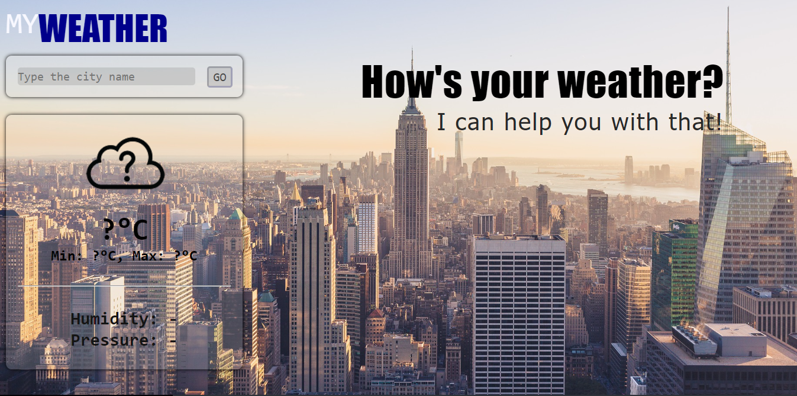

# MyWeather
A web application consuming an weather API made for weather forecasts 
You can see my project here: https://mywapp.netlify.app, or you can download the directory and open the <b>index.html</b> file! 
The API that I used: https://openweathermap.org/

  

